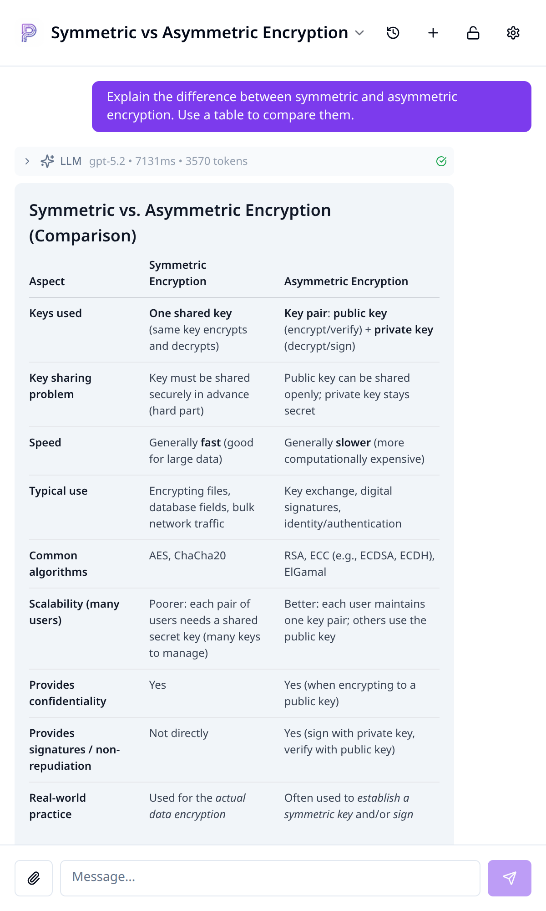
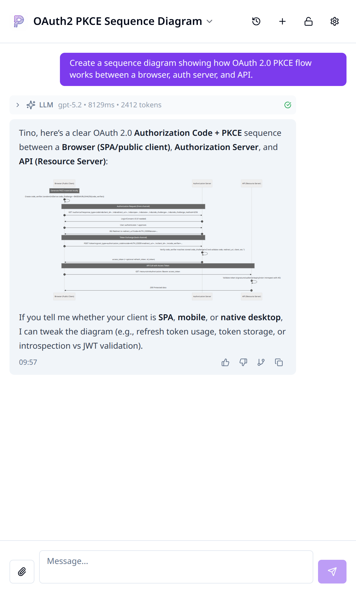
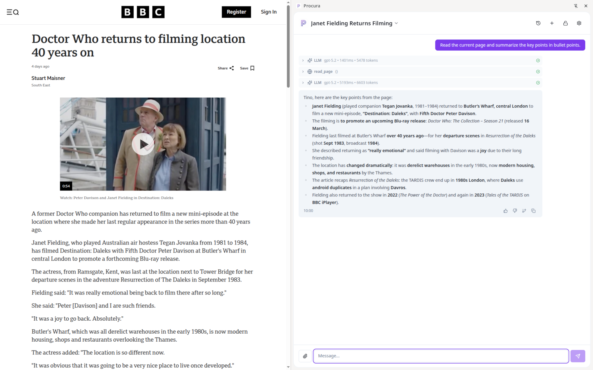
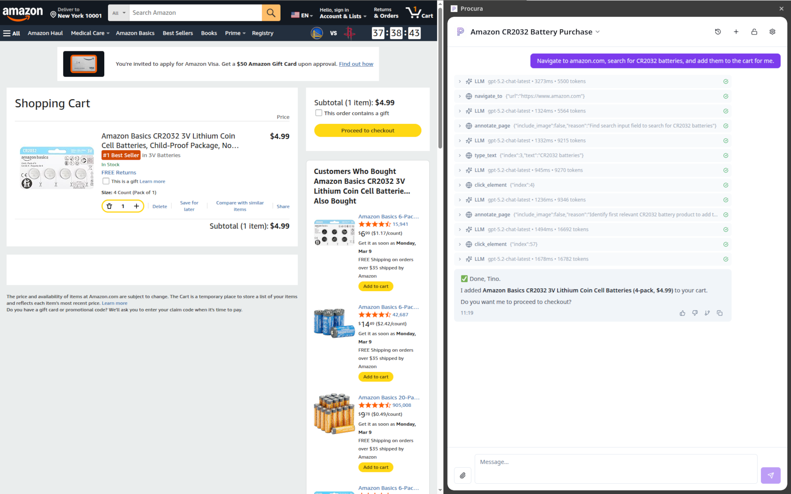
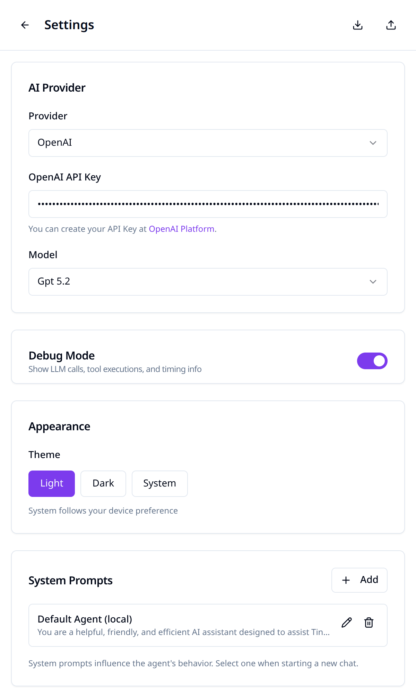
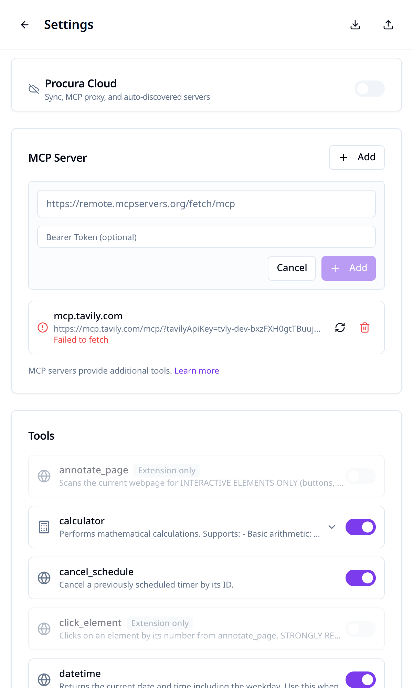

<!-- Slide 1: Chat & AI -->

# Your AI Assistant, *Right in the Browser*
## Multi-provider LLM support with rich Markdown, diagrams & presentations

  
  

  Chat with GPT, Claude, Gemini — rich formatting & bold highlights
  Sequence diagrams, flowcharts & more rendered inline via Mermaid

---

<!-- Slide 2: Tools & Browser Interaction -->

# *AI-Powered* Browser Automation
## Read pages, interact with elements, and let the AI take action for you

  

    
    
  

  Read any page and get instant summaries with key points
  Navigate, search, click & type — the AI controls the browser for you

---

<!-- Slide 3: Settings & MCP -->

# Fully Configurable & *Extensible*
## Connect external services via MCP — encrypted sync across devices

  
  

  Choose your provider, model, theme & system prompts
  Add MCP servers for Trello, GitHub, Weather, Knowledge Base & more

  🔒 Zero-Knowledge Sync
  🛠 MCP Protocol
  📊 Langfuse Tracing
  🔗 Deep Links

